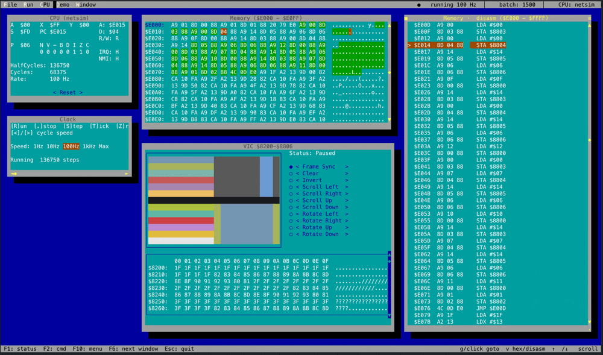
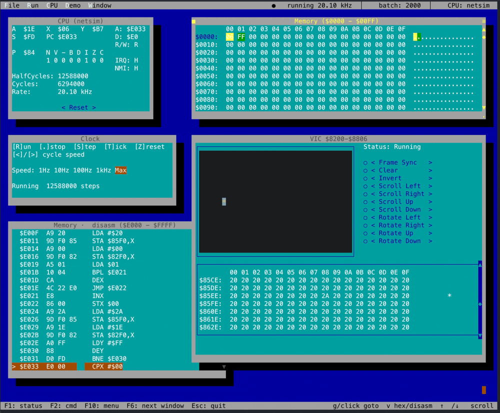

# 6502-sim-tui

A floating-window 6502 system simulator with two interchangeable CPU
cores, live visualization, and a small library of demo programs.
Built on top of [`foxpro-go`](https://github.com/carledwards/foxpro-go)
(FoxPro-for-DOS-style TUI framework) and
[`6502-netsim-go`](https://github.com/carledwards/6502-netsim-go)
(transistor-level Visual6502 port). Components plug into a shared bus
at user-configurable addresses; each gets its own draggable window.

The point is to make a 6502 system you can *see*: every memory
access, every register, every framebuffer cell visible in real time.

## Screenshots





## Quickstart

This repo expects two sibling checkouts:

```
6502-sim-tui/    <-- this repo
foxpro-go/       <-- TUI framework
6502-netsim-go/  <-- transistor-level CPU
```

`go.mod` has `replace` directives pointing at the siblings during
development.

```bash
make tidy
make run
```

Esc or Ctrl+Q to quit.

### CLI flags

| Flag           | Default   | Notes                                                 |
|----------------|-----------|-------------------------------------------------------|
| `-cpu`         | `netsim`  | CPU backend: `netsim` (transistor) or `interp` (interpretive) |
| `-run`         | `false`   | Start the clock running immediately                  |
| `-speed`       | (unset)   | Initial clock target: `1`, `10`, `100`, `1k`, `max`  |
| `-batch`       | `500`     | Max half-cycles per UI tick — raise for `interp`     |
| `-cpuprofile`  | (off)     | Write CPU pprof to file                              |
| `-memprofile`  | (off)     | Write heap pprof at exit                             |

## Memory map

Honest hardware-style decoding — components claim address ranges and
the bus dispatches based on the high bits, the way a real 74-series
glue logic board would.

| Range              | Component             | Size    |
|--------------------|-----------------------|---------|
| `$0000`–`$1FFF`    | RAM                   | 8 KB    |
| `$8200`–`$8407`    | VIC color plane       | 520 B   |
| `$8500`–`$8707`    | VIC char plane        | 520 B   |
| `$8800`–`$8806`    | VIC controller regs   | 7 B     |
| `$E000`–`$FFFF`    | ROM (program + reset vector at `$FFFC`) | 8 KB |

VIC controller registers:

| Offset | Reg          | Behavior                                                   |
|--------|--------------|------------------------------------------------------------|
| `+0`   | Cmd          | Write triggers an op (Clear, ShiftXxx, RotXxx, Invert, RectXxx) |
| `+1`   | Pause        | `1` = UI shows snapshot; `0` = UI shows live memory       |
| `+2`   | Frame        | Any write captures a new snapshot (use while paused)      |
| `+3`   | RectX        | Rect parameters consumed by `CmdRect*` opcodes — clamped  |
| `+4`   | RectY        | to display bounds; out-of-bounds rects are no-ops          |
| `+5`   | RectW        |                                                            |
| `+6`   | RectH        |                                                            |

`CmdShift*` and `CmdRot*` operate on the whole display; `CmdRectShift*`
and `CmdRectRot*` operate only on the rect specified by RectX/Y/W/H.

## CPU backends

| Backend | Speed       | What it is                                              |
|---------|-------------|---------------------------------------------------------|
| `netsim` | ~26 kHz    | Transistor-level Visual6502 port — every cycle simulates ~3500 transistors |
| `interp` | ~MHz       | Conventional 151-opcode interpretive 6502               |

The `Backend` interface (`cpu/backend.go`) lets you swap at runtime
via the **CPU** menu. Both expose the same address/data bus state
plus IRQ/NMI for the simulator's introspection windows.

## Windows

Every component gets its own floating, draggable window. Click in the
title bar to drag, click the corner to resize.

- **CPU** — A/X/Y/S/PC, P flags, half-cycle counter, live address bus,
  data bus, R/W direction, IRQ/NMI line states. Reset button.
- **Memory** — hex view + ASCII column with editable base address
  (click the `$XXXX:` button, type 4 hex digits). Trace tinting:
  yellow = write that *changed* the byte, brown = write that left it
  unchanged, green = read. Switch to disassembly view with `v` —
  shows decoded instructions with effects panel (`i` to toggle).
- **VIC** — 40×13 framebuffer with 16-color palette + character glyph
  per cell. Right column has buttons for every controller command.
  Below the framebuffer, a scrollable hex strip shows the VIC's
  memory region — drag the thumb, click the arrows, mouse-wheel, or
  `[ ] { }` to navigate.
- **Clock** — current rate, target, batch size. Run / Stop / Step /
  Tick controls and a speed selector.

## Demos

Selectable from the **Demo** menu. The menu has two sections — "live"
demos that run unpaused (UI shows current memory) and "framed" demos
that pause and trigger frames manually so the user sees clean
snapshots.

| Demo            | What it does                                                |
|-----------------|-------------------------------------------------------------|
| Marquee         | Scrolling "HELLO 6502 SIM" via `CmdRotLeft`                |
| Bouncer         | Single `*` bouncing across row 6                          |
| Scroller        | Diagonal gradient scrolling up the display                 |
| Snow (LFSR)     | 8-bit Galois LFSR fills + clears the framebuffer          |
| Scroller (framed) | Same as Scroller but uses Pause + Frame for clean updates |
| Blitter (RAM→VIC) | Copies byte patterns out of RAM into the VIC planes      |
| Quadrants       | 4 independent rect rotations (one per quadrant) using `CmdRect*` |

## Menu shortcuts

| Key       | Action                              |
|-----------|-------------------------------------|
| `Z`       | Reset machine                       |
| `F2`      | Toggle command window               |
| `R`       | Run                                 |
| `.`       | Stop                                |
| `S`       | Step one instruction (until PC changes) |
| `T`       | Step one half-cycle ("tick")        |
| `Esc`     | Quit                                |

In the Memory window:

| Key       | Action                              |
|-----------|-------------------------------------|
| `g`       | Edit base address                   |
| `v`       | Toggle hex / disassembly view       |
| `i`       | Toggle disassembly info panel       |

In the VIC window's hex strip:

| Key / mouse        | Action                      |
|--------------------|-----------------------------|
| Mouse wheel        | Scroll memBase by 1 row     |
| `[` / `]`          | Scroll by 1 row (16 bytes)  |
| `{` / `}`          | Scroll by 1 page (112 bytes) |
| Click `▲` / `▼`    | ±1 row                      |
| Click track        | Page up/down                |
| Drag `◆`           | Jump to position            |

## Architecture

Single-threaded. `App.Tick` (50 ms) drives both UI redraws and the
simulator advance — no goroutines, no locks. The clock provider
calls `Backend.HalfStep` in batches sized to fit the 35 ms budget,
which is what auto-tune calibrates.

Read `docs/architecture.md` for layering, interfaces, and component
contracts. `docs/roadmap.md` tracks remaining work.

## Project layout

```
cmd/6502-sim/        application entry, main wiring, demo programs
bus/                 Bus interface, Component, TraceBus (read/write generation tracking)
cpu/                 Backend interface
cpu/netsim/          netsim adapter
cpu/interp/          interpretive 151-opcode 6502
components/          ram, rom, display, clock, ttybuf, keyboard
disasm/              151-opcode disassembler with cycle counts and effects
ui/                  cpuwin, ramwin, displaywin, clockwin, etc.
docs/                architecture, roadmap
```

## Status

Working. The transistor-level core hits ~26 kHz on a recent Mac;
the interpretive core is several MHz. Both pass the same demos.

Bus, disassembler, Backend interface, and the embedded assembler
(`cmd/6502-sim/quaddemo.go`) are eventual candidates for promotion
into the base `6502-netsim-go` repo as a "6502 system kit" — see
notes at the bottom of `docs/architecture.md`.

## License

MIT — see [LICENSE](LICENSE).
